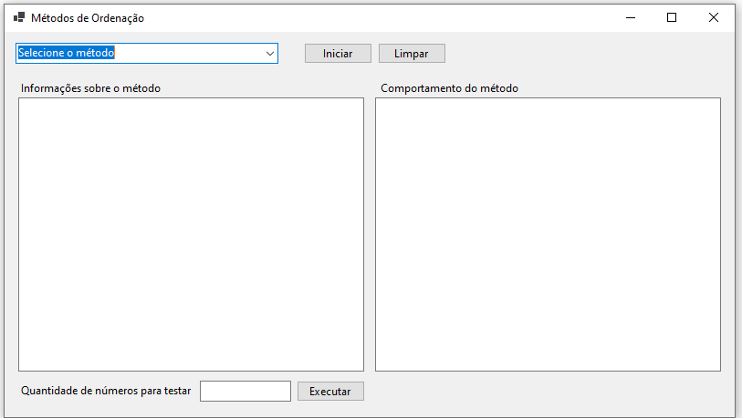

# Tarefa 3 - métodos de ordenação

Construir um programa visual (C# ou Java) em que o usuário possa selecionar um dos métodos de ordenação estudados em aula.
Uma vez selecionado o método, o programa deve possuir uma área com informações sobre o método (nome em inglês,
complexidade, estabilidade, data, etc). Também, o programa deve ter a possibilidade do usuário testar o comportamento do método.
Assim, deve ter uma área em que o usuário possa definir a quantidade de números a serem testados, bem como uma área que exiba
informações do teste, como quantidade de números e tempo de processamento para ordenar os números solicitados.

Ideia de interface

